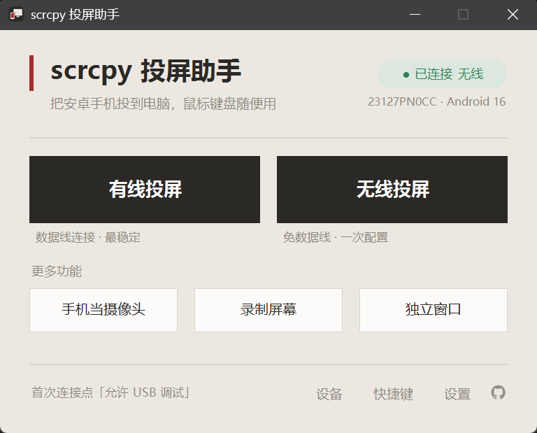
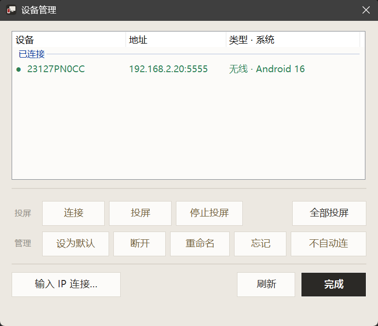
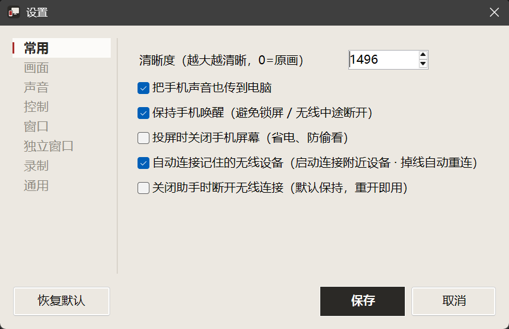

# scrcpy 投屏助手 · scrcpy Helper (Windows)

给 [scrcpy](https://github.com/Genymobile/scrcpy) 套一层 **免安装、双击即用、全中文** 的 Windows 图形界面。
A zero-install, double-click, Chinese-first GUI wrapper for **scrcpy** on Windows.

> 365 开源计划 #019 · 给 scrcpy 套一层免安装、双击即用、全中文的 Windows 投屏图形界面

## 这是什么 · What

scrcpy 是优秀的安卓投屏工具，但它是命令行程序，对普通用户不友好。本项目用一个 **单文件 PowerShell 脚本** 给它套了个图形界面：解压、双击，点按钮就能投屏，常用设置一键勾选，零基础也能上手。

> scrcpy is great but command-line only. This wraps it in a tiny PowerShell GUI — unzip, double-click, click a button. No install, no runtime, all Chinese UI.

## 特点 · Features

- 🟢 **绿色单文件**：一个 `.ps1` + 一个 `.bat`，零依赖、免安装，U 盘 / 受限电脑也能跑。
- 🇨🇳 **全中文 + 人话提示**：每个设置悬停都有大白话说明。
- 🖥️ 有线 / 无线投屏、手机当摄像头、录屏、独立窗口（虚拟显示器），都是一个按钮。
- 📶 **无线三种方式**：插一次线自动切无线（可拔线）；Android 11+ 支持配对码连接，全程免插线（只填配对地址 + 配对码，连接端口自动识别）；或直接输入 IP 连接作保底（手机开了网络 adb 即可，不限系统版本）。
- 🗂️ **多设备管理 + 同时多投**：「设备管理」里连接与投屏分开，可重命名 / 设默认 / 断开 / 忘记；连过的无线设备自动记住。支持「全部投屏」/ 多选投屏，多台各开一个窗口同时镜像（窗口标题即设备名、列表标「▶ 投屏中」），「停止投屏」可单独关掉某一台。**断线后直接点投屏/录屏/摄像头/独立窗口**，会先自动连回「记住的、当前在线」的设备再开始（带连接提示、离线地址快速跳过），不必每次重选连接方式。
- 📷 **摄像头按机型自适配**：打开摄像头时运行时读取本机真正支持的采集分辨率（`--list-camera-sizes`），下拉只列「一定能开」的尺寸并用精确 `--camera-size` 启动，根治写死 1920x1080 在部分机型/前置摄像头上的 `Camera configuration error`；前/后置切换自动刷新，读不到列表时回退到高 / 中 / 原始最高档位。前/后置、横/竖屏、分辨率、补光灯、麦克风等选择都会记住，下次打开沿用（前置竖屏方向也已校正、不再上下颠倒）。
- 🪟 **独立窗口可调方向**：单开 App 的虚拟屏可选竖屏·手机版面 / 横屏·平板版面 / 自定义比例（解决微信、QQ 被当平板、显示不全），并可「固定方向」缓解最大化/全屏时画面循环自转。
- 🧠 **省心细节**：顶部显示手机型号 + 安卓版本；摄像头(12+)/独立窗口(11+)版本不够会友好提示；独立窗口可从手机已装 App 列表直接挑（中文名、可搜索），还能固定成自己的常用清单；录屏文件名自动带时间戳不覆盖。
- ⌨️ **快捷键速查 + 拖拽**：内置 scrcpy 常用快捷键速查表（全屏 / 息屏 / 旋转 / 复制粘贴…）；投屏窗口可拖入文件传到手机、拖入 APK 一键安装。
- ⚙️ 「常用」设置页按使用度聚合最高频项：清晰度、传声音、保持唤醒、投屏关屏、无线自动重连……改完自动记忆。
- 🔌 关窗口=停投屏（录屏先确认，且会给录制进程发 Ctrl+C 正常收尾、保证文件完整，后台录制也不例外），最小化=投屏继续；关闭时自动结束自带 adb 后台进程、可选断开无线连接，助手自身也随之干净退出、不留残留进程。
- 1️⃣ **单实例**：同一时间只运行一个助手；启动即把窗口带到最前（`conhost --headless` 下也不再开在后台），已经开着时再次双击运行只会激活已有窗口、不重复叠开（也避免两个进程互相覆盖设置）。

### 已知限制 · Known limitations

- **电脑输入法的中文打不进投屏窗口**（只能粘贴）：scrcpy + Windows 输入法的固有限制，输入法「组词」阶段的字捕获不到。临时用 `Ctrl+V` 粘贴；彻底解决可给手机装 [ADBKeyboard](https://github.com/senzhk/ADBKeyBoard) 设为输入法，或键盘模式选「游戏模式」用手机自带输入法打拼音。
- **应用双开 / 分身在独立窗口里黑屏**：分身运行在另一个安卓用户身份下、且部分应用拒绝在虚拟屏渲染，scrcpy 无法定向到分身；建议改用普通投屏在手机上开分身。

## 界面 · Screenshots

| 设备管理：多设备切换 / 同时多投 | 设置：左侧分类，改完自动记忆 |
| :---: | :---: |
|  |  |

## 怎么用（普通用户）· Usage

1. 到 [Releases](../../releases) 下载打包好的 zip（已内置 scrcpy），解压到任意文件夹。
2. 手机开启「USB 调试」（设置 > 关于手机 > 连点 7 次版本号 > 开发者选项）。
3. 双击 `投屏助手-双击运行.bat`，点「有线投屏」即可。

详见随包的 `使用说明.txt`。

## 与 QtScrcpy / escrcpy 的区别 · Why another one

想要功能完整、跨平台，更推荐成熟的 [QtScrcpy](https://github.com/barry-ran/QtScrcpy) 或 [escrcpy](https://github.com/viarotel-org/escrcpy)。本项目走的是另一条路：一个单脚本、免安装的小工具，界面全中文。如果你只是想简单投个屏、又偏爱绿色便携，可以试试它。

> Want full features? Go with QtScrcpy / escrcpy. This is just a tiny, no-install, Chinese GUI for simple mirroring.

## 打包发布 · Build a release

仓库不含 scrcpy 二进制。打包很简单：把 `scrcpy-helper.ps1`、`投屏助手-双击运行.bat`、`使用说明.txt` 三个文件复制进 [scrcpy](https://github.com/Genymobile/scrcpy/releases) 的解压目录，整个文件夹压成 zip 即可。用户解压后双击 `.bat` 就能用。

> **请用 scrcpy 4.0 及以上版本打包**。助手用到了 `--flex-display`（独立窗口）和 `--keep-active`（无线投屏保持唤醒），这两个参数是 scrcpy 4.0 才加入的；用旧版打包会导致这两项功能因「未知参数」失败。

## 致谢 · Credits

- 投屏核心：[scrcpy](https://github.com/Genymobile/scrcpy)（Apache-2.0）by Genymobile。本项目仅是其图形外壳。
- 图文教程：<https://newzone.top/posts/2019-08-26-scrcpy_screen_projection.html>

## 许可证 · License

封装脚本以 [MIT](./LICENSE) 开源；scrcpy 本体遵循其 Apache-2.0 许可。

## 贡献 · Contributing

欢迎 issue / PR。**多语言（i18n）** 尤其欢迎：当前界面文案内嵌在脚本里，后续可抽成字符串表以支持英文等语言。

## 关于 365 开源计划 · About

本项目是 [365 开源计划](https://github.com/rockbenben/365opensource) 的第 19 个项目。

一个人 + AI，一年 300+ 个开源项目。[提交你的需求 →](https://my.feishu.cn/share/base/form/shrcnI6y7rrmlSjbzkYXh6sjmzb)
