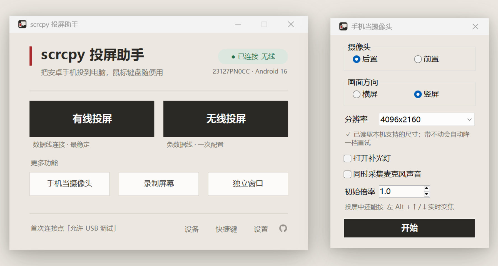
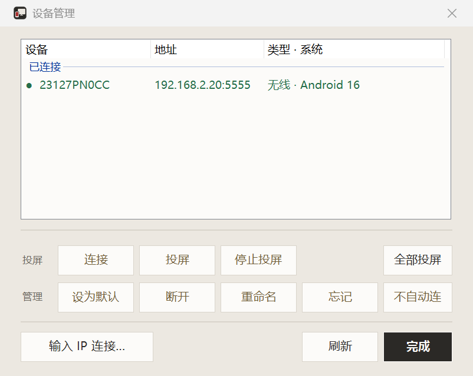
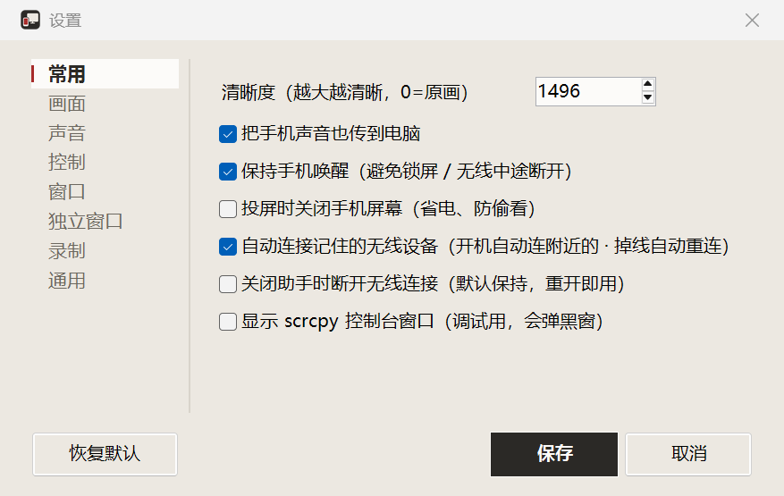

# scrcpy 投屏助手

> 不用背命令行参数，勾几个选项就把安卓手机投屏到电脑 —— 免安装，双击即用

 

**[⬇ 下载最新版](https://github.com/rockbenben/scrcpy-helper/releases/latest)** · Windows 10 / 11 · 已内置 scrcpy，不用另外装

[scrcpy](https://github.com/Genymobile/scrcpy) 是最好用的安卓投屏工具，但它只有命令行。本项目用一个单文件 PowerShell 脚本给它套了层图形界面：解压、双击、点按钮，清晰度和编码勾一下就好，不必再记 `--video-codec=h265 --max-size=1920` 这类参数。想要功能完整、跨平台，[QtScrcpy](https://github.com/barry-ran/QtScrcpy) 和 [escrcpy](https://github.com/viarotel-org/escrcpy) 更成熟；这里走的是另一条路——一个绿色便携的小工具，全中文，拷进 U 盘也能跑。

> [!TIP]
> 全程本地直连（数据线，或同一个 Wi-Fi），画面不经过任何服务器；手机端不 root、不装 App，只需打开「USB 调试」。

## 支持范围

| 项目 | 支持情况 |
| --- | --- |
| 电脑 | Windows 10 / 11，用系统自带 PowerShell，无需 .NET 或其他运行库 |
| 安装 | 不需要，解压双击即可；卸载 = 删掉文件夹 |
| 手机 | Android 5.0 起可投屏、录屏；配对码无线连接与独立窗口需 11+，手机当摄像头需 12+ |
| 连接 | 数据线，或无线（同一局域网），可同时连多台 |
| 管理员权限 | 不需要，而且别用——会导致拖文件进投屏窗口失效 |

## 能做什么

- 🖥️ **有线 / 无线投屏**：无线有三种走法——插一次线自动切换（之后可拔线）、Android 11+ 用配对码全程免插线、或直接填 IP 保底。
- 📷 **手机当摄像头**：分辨率按机型实测列表给，不会选到开不起来的档位；可变焦到超广角或长焦，倍率会记住；手机亮屏被系统抢走摄像头时自动重连。
- 🎥 **录制屏幕**：边投边录，存 mp4 / mkv，文件名带时间戳不会覆盖上一次。
- 🪟 **独立窗口**：在电脑上单开一块虚拟屏跑某个 App，手机照常用；可选竖屏·手机版面 / 横屏·平板版面 / 自定义比例。
- 🗂️ **多设备**：连接与投屏分开，可同时投多台各开一窗；连过的设备自动记住，断线后点任意功能会先自动连回。
- 📎 **拖拽即传**：文件拖进投屏窗口就传到手机，拖 APK 进去直接安装。
- ⚙️ **全中文，改完就记**：每个设置悬停都有大白话说明；清晰度、编码、声音等选择自动记忆，下次沿用。

| 设备管理：多设备切换 / 同时多投 | 设置：左侧分类，改完自动记忆 |
| :---: | :---: |
|  |  |

## 快速开始

1. 下载 [Releases](https://github.com/rockbenben/scrcpy-helper/releases/latest) 里的 zip，解压到任意文件夹。
2. 手机开启「USB 调试」：设置 > 关于手机 > 连点 7 次版本号，返回设置进「开发者选项」打开。
3. 双击 `投屏助手-双击运行.bat`，插上数据线，点「有线投屏」。

首次连接时手机上会弹「允许 USB 调试」，点允许就好。逐项说明见随包的 `使用说明.txt`，也可看[图文教程](https://newzone.top/posts/2019-08-26-scrcpy_screen_projection.html)。

## 已知限制

- **以管理员身份运行时，拖文件进投屏窗口会显示禁止图标。** Windows 不允许普通权限的资源管理器向管理员权限的窗口拖放（UIPI 隔离）。助手本就无需管理员，正常双击 `.bat` 即恢复。
- **电脑输入法的中文打不进投屏窗口**（只能 `Ctrl+V` 粘贴）。这是 scrcpy + Windows 输入法的固有限制，组词阶段的字捕获不到。彻底解决可给手机装 [ADBKeyboard](https://github.com/senzhk/ADBKeyBoard)，或键盘模式选「游戏模式」用手机自带输入法。
- **应用双开 / 分身在独立窗口里黑屏。** 分身跑在另一个安卓用户身份下，且部分应用拒绝在虚拟屏渲染，scrcpy 无法定向过去；改用普通投屏在手机上开分身即可。

## 许可证

本仓库的三个文件（`scrcpy-helper.ps1`、`投屏助手-双击运行.bat`、`使用说明.txt`）以 [MIT](./LICENSE) 开源。

发行包里除此之外的一切都来自 Genymobile 的 [scrcpy](https://github.com/Genymobile/scrcpy) 官方 win64 发行包，**原样转发、未作修改**，遵循其 Apache-2.0 许可，随包的 `LICENSE.txt` 即该许可全文。逐项清单见 [THIRD-PARTY-NOTICES.md](./THIRD-PARTY-NOTICES.md)。

想自己打包发行版、或帮忙做界面多语言，见 [CONTRIBUTING.md](./CONTRIBUTING.md)。

## 关于 365 开源计划

[365 开源计划](https://github.com/rockbenben/365opensource) 的第 **#019** 个项目——一个人 + AI，一年 300+ 个开源项目。

[提交你的需求 →](https://365.aishort.top/) · [Discord](https://discord.gg/PZTQfJ4GjX) · [Telegram](https://t.me/aishort_top)
